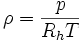
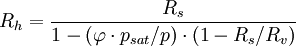

air
===

air density (mass per unit volume of Earth atmosphere) function of temperature, altitude (default sea level) and humidity.



## dry air

The specific gas constant for dry air (`Rh`) is equal to `287.058 J/kg.K`.

```js
var density = require('air');

// 0 °C
density(273.15);
// => 1.2922 kg·m−3

// 20 °C
density(293.15);
// => 1.2041 kg·m−3
```

## humidity

The molar mass of water is smaller than the molar mass of dry air and so, reduces the density of air. The specific gas constant for water air (`Rh`) is equal to:



```js
// 0 °C, altitude 0 and 70% humidity
density(273.15, 0, 0.7);
```

> this formula only work with temperatures between `243.15K` and `343.15K`.

## License

The MIT License (MIT)

Copyright (c) 2014 Olivier Wietrich <olivier.wietrich@gmail.com>

Permission is hereby granted, free of charge, to any person obtaining a copy of this software and associated documentation files (the "Software"), to deal in the Software without restriction, including without limitation the rights to use, copy, modify, merge, publish, distribute, sublicense, and/or sell copies of the Software, and to permit persons to whom the Software is furnished to do so, subject to the following conditions:

The above copyright notice and this permission notice shall be included in all copies or substantial portions of the Software.

THE SOFTWARE IS PROVIDED "AS IS", WITHOUT WARRANTY OF ANY KIND, EXPRESS OR IMPLIED, INCLUDING BUT NOT LIMITED TO THE WARRANTIES OF MERCHANTABILITY, FITNESS FOR A PARTICULAR PURPOSE AND NONINFRINGEMENT. IN NO EVENT SHALL THE AUTHORS OR COPYRIGHT HOLDERS BE LIABLE FOR ANY CLAIM, DAMAGES OR OTHER LIABILITY, WHETHER IN AN ACTION OF CONTRACT, TORT OR OTHERWISE, ARISING FROM, OUT OF OR IN CONNECTION WITH THE SOFTWARE OR THE USE OR OTHER DEALINGS IN THE SOFTWARE.